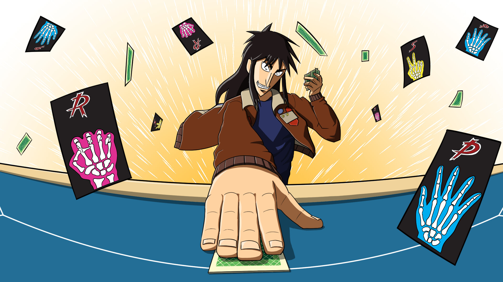

# Restricted Rock-Paper-Scissors 

Restricted Rock-Paper-Scissors is one of the most famous and intense games featured in the [Kaiji](https://www.imdb.com/title/tt1202625/) series. It appears early in the story and sets the stage for the series exploration of psychological manipulation, strategy, and high-stakes gambling. Here’s a breakdown of how the game works and its significance in the series.

## Overview:
- **Game Name**: Restricted Rock-Paper-Scissors (制限ジャンケン, *Seigen Janken*)
- **Appears in**: The first arc of *Kaiji*, often referred to as the "Espoir" arc.
- **Participants**: A large number of debt-ridden individuals, including the protagonist, Kaiji Itou.
- **Setting**: The game takes place aboard a luxury cruise ship called the Espoir, where participants have been gathered to gamble their way out of debt.

## Rules of the Game:
1. #### Cards instead if hands:
    - Each player is given a limited set of cards, each representing Rock, Paper, or Scissors. Typically, each player starts with 12 cards: 4 Rocks, 4 Papers, and 4 Scissors.
2. #### Stars as Lives:
    - Each player starts with three "stars," which represent their lives or points. Losing all stars means being eliminated from the game.
3. #### Game Objective:
    - The goal is to finish with at least three stars and no remaining cards. Players must use strategy to maintain their stars while using up their cards.
4. #### Gameplay Mechanics:
    - Players challenge each other to Rock-Paper-Scissors matches using their cards.
    - Both players place one card face down, and the cards are revealed simultaneously.
    - The standard rules of Rock-Paper-Scissors apply (Rock beats Scissors, Scissors beats Paper, Paper beats Rock).
    - The winner takes one star from the loser. If the game is a draw, neither player gains or loses a star.
5. #### Ending the game:
    - The game ends when the time limit is reached, or when a player has no cards left. A player must have at least three stars and no cards to exit the game successfully. Failure to meet these conditions results in severe consequences, including further debt or even physical harm.

## Image

## In my version of the game:

- You play against the computer
- You both start with 3 stars
- You both have unlimited cards 
- The game is divided into multipe rounds
- Whoever wins a round gets an extra star, and the loser loses one
- In case of a tie no stars are exchanged
- Whoever loses all their stars loses the game

You want to play ? [Click here](https://elmerjani.github.io/Rock-Paper-Scissors/)

## Screenshots

